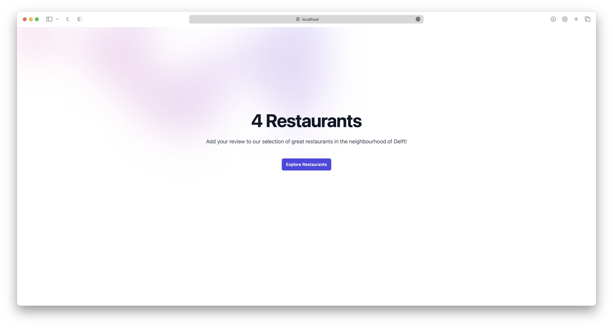
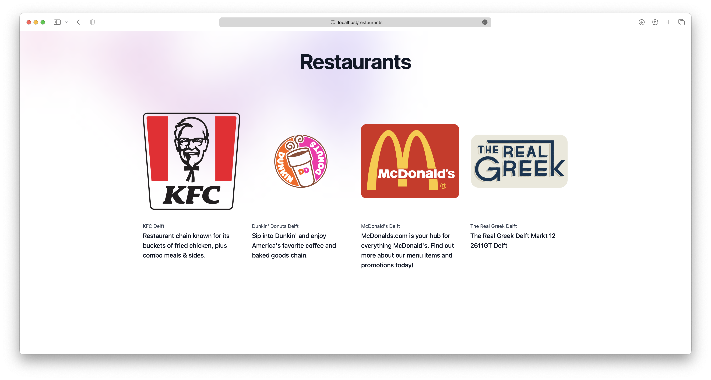
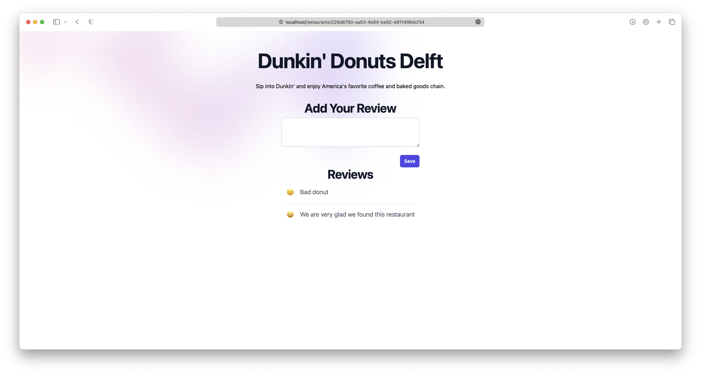

# Operation
This repository contains the deployment files for the application.
The application is a simple web application that allows users to view restaurants and add reviews.

## Prerequisites
- [Docker](https://www.docker.com)
- Docker compose / [Helm](https://helm.sh)
- A valid session to the ghcr.io docker registry:
  ```sh
  docker login ghcr.io
  ```

## Usage (Helm)
### Installation
1. Add the repository to helm:
   ```sh
   helm repo add remla23-team14 https://remla23-team14.github.io/operation
   ```
2. Run helm update:
   ```sh
   helm repo update
   ```
3. Install the application:
   ```sh
   helm install app remla23-team14/app
   ```
   Please refer to the values.yaml file for the available configuration options.
   You can set these by duplicating the [charts/app/values.yaml](../charts/app/values.yaml) file and changing the values.
   Then, you can install the application with the following command:
   ```sh
   helm install app remla23-team14/app -f values.yaml
   ```

### Access the application
To access the application, connect to the ingress on port 80.
If you are using [minikube](https://github.com/kubernetes/minikube),
you can use the following command:
```sh
minikube tunnel
 ```
This will expose the ingress on [http://localhost:80](http:localhost:80).

### Access Prometheus & Grafana
To access Prometheus and Grafana, by default, the domains `prometheus.local` and `grafana.local` are used.
Make sure you have the following lines in your `/etc/hosts` file, or the equivalent for your OS:
```sh
127.0.0.1 prometheus.local
127.0.0.1 grafana.local
```
You can then access Prometheus on [http://prometheus.local](http://prometheus.local) and Grafana on [http://grafana.local](http://grafana.local).
Use the following credentials to login to Grafana:
- Username: `admin`
- Password: `prom-operator`

## Usage (docker compose)
### Installation
Run the following command in the repository root:
```sh
docker compose up
```

If you want to specify a different model for the model-service,
you can uncomment the following lines in the `docker-compose.yml` file:
```yml
services:
  model-service:
    ...
#    volumes:
#      - ./model-training/c1_BoW_Sentiment_Model.pkl:/root/model-training/c1_BoW_Sentiment_Model.pkl
#      - ./model-training/c2_Classifier_Sentiment_Model:/root/model-training/c2_Classifier_Sentiment_Model
```
Make sure you have the model files in the `model-training` folder (or change it).

### Access
The application will be available at [http://localhost:80](http:localhost:80).

## Organization structure
To understand the application, it may be useful to check the following repositories their README files:
- [model-training](https://github.com/remla23-team14/model-training): contains the code for training the model.
- [model-service](https://github.com/remla23-team14/model-service): serves the sentiment model.
- [lib](https://github.com/remla23-team14/lib): simple version library for the app.
- [app](https://github.com/remla23-team14/app): contains the frontend and backend code for the application, which queries the model-service backend for a sentiment analysis.

## Operaton Setup
Grafana dashboards can be added as json in the `charts/app/dashboards` folder.
They will automatically be loaded into Grafana.

To deploy a new version of the Helm chart,
simply bump the version in Chart.yaml and the new version will be deployed.

## Screenshots
### Landing page


### Restaurants Overview


### Restaurant Reviews

