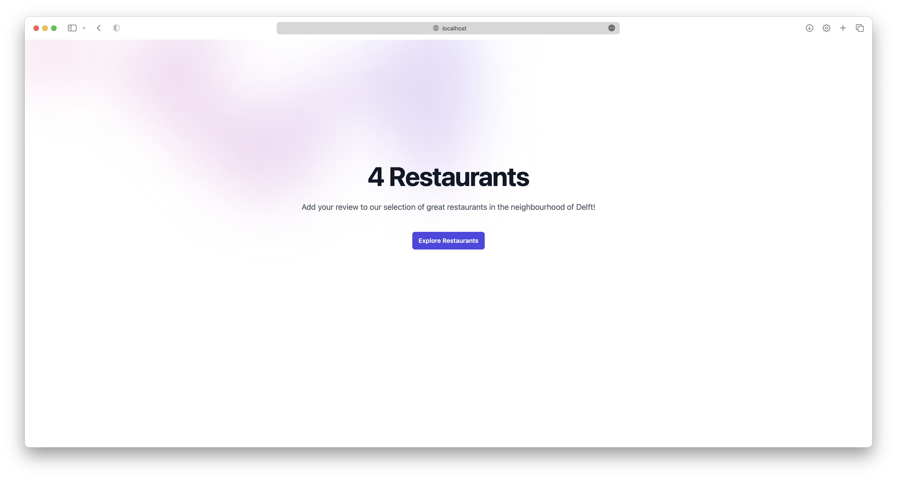
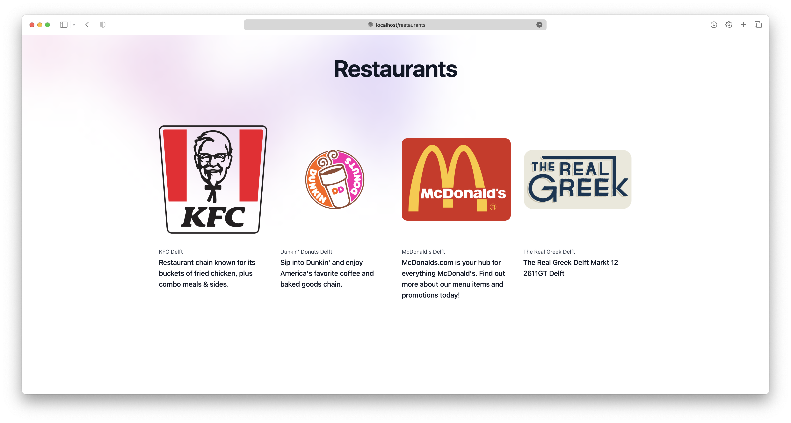
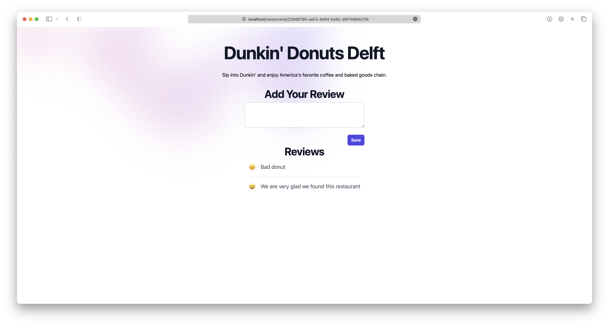

# A1: Operation
This repository contains the docker compose file for the application.

## Usage
- Retrieve the `docker-compose.yml` file.
- Login to the ghcr.io docker registry:
  ```sh
  docker login ghcr.io
  ```
- Run the following command in the same folder as the docker compose file:
  ```sh
  docker compose up
  ```
- The application will be available at [localhost:80](http:localhost:80).

## Organization structure
To understand the application, it may be useful to check the following repositories their README files:
- [model-training](https://github.com/remla23-team14/model-training): contains the code for training the model.
- [model-service](https://github.com/remla23-team14/model-service): serves the sentiment model.
- [lib](https://github.com/remla23-team14/lib): simple version library for the app.
- [app](https://github.com/remla23-team14/app): contains the frontend and backend code for the application, which queries the model-service backend for a sentiment analysis.

## Screenshots
### Landing page


### Restaurants Overview


### Restaurant Reviews

